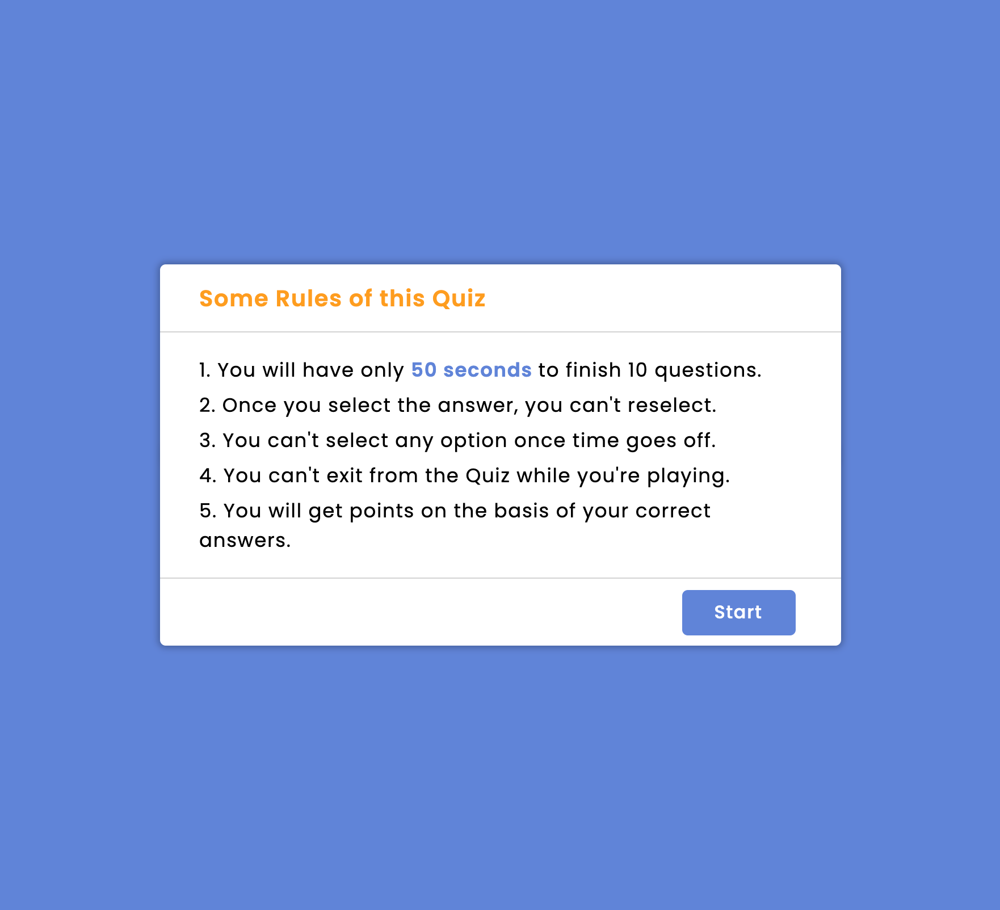

# 04 Web APIs: Code Quiz

## Description 

A code quize that you have to complete them in 50 seconds, once you select the answer, you can't reselect. 
You can't select any options once time goes off and you will get points on the basis of your correct answers.

### User Story

```
AS A coding boot camp student
I WANT to take a timed quiz on JavaScript fundamentals that stores high scores
SO THAT I can gauge my progress compared to my peers
```

### Acceptance Criteria

```
GIVEN I am taking a code quiz
WHEN I click the start button
THEN a timer starts and I am presented with a question
WHEN I answer a question
THEN I am presented with another question
WHEN I answer a question incorrectly
THEN time is subtracted from the clock
WHEN all questions are answered or the timer reaches 0
THEN the game is over
WHEN the game is over
THEN I can save my initials and my score
```

## Technology Used

Uses addEventlistener, getElementById, classList.add/remove, if, for loop, JSON, timer, etc.

## License 

[](https://www.gnu.org/licenses/MIT%20License)

## Others


[Click me for website](https://mt0814.github.io/Week4-HW-Code-Quiz/)

---

© 2021 Trilogy Education Services, LLC, a 2U, Inc. brand. Confidential and Proprietary. All Rights Reserved.
